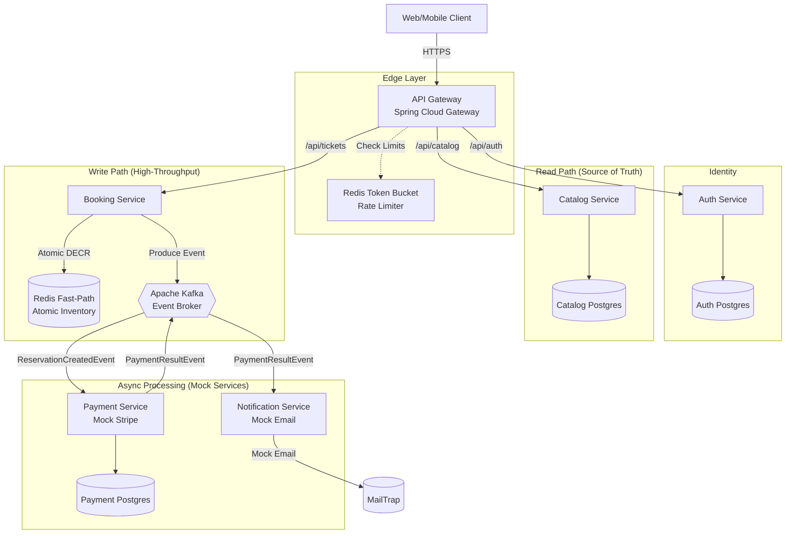

# 🎟️ TicketBlitz: High-Throughput Ticketing Architecture

TicketBlitz is an enterprise-grade, event-driven microservices platform designed to handle massive "thundering herd" traffic spikes during high-demand concert and sports ticket drops. Unlike standard CRUD applications, TicketBlitz is engineered for System Resilience and High Concurrency, utilizing a Redis Fast-Path to protect the relational database from crashing under load, and Asymmetric Edge Security for zero-latency authentication.

## ✨ Key Features

- **Zero-Latency Authentication:** JWT verification happens entirely at the API Gateway edge using RS256 cryptography.
- **Thundering Herd Protection:** Redis token-bucket rate limiting prevents API abuse and DDoS attacks during ticket drops.
- **Overbooking Prevention:** Atomic DECR operations in Redis ensure tickets are never double-sold, bypassing slow relational DB locks.
- **Event-Driven Fulfillment:** Kafka message queues decouple the fast-path booking from the slow-path payment and email notifications.
- **Reactive UI:** Angular 17 interface with Server-Side Rendering (SSR) and signal-based state management.

## 📊 Current Implementation Status

| Service                     | Status   | Port | Description                                              |
| --------------------------- | -------- | ---- | -------------------------------------------------------- |
| ✅ **Web Frontend (UI)**    | Complete | 4200 | Angular 17+ UI with Server-Side Rendering (SSR)          |
| ✅ **API Gateway**          | Complete | 8080 | Spring Cloud Gateway with rate limiting & JWT validation |
| ✅ **Auth Service**         | Complete | 8082 | JWT generation & user authentication                     |
| ✅ **Catalog Service**      | Complete | 8083 | Event catalog with PostgreSQL persistence                |
| ✅ **Booking Service**      | Complete | 8081 | High-throughput reservation engine with Redis & Kafka    |
| 🚧 **Payment Service**      | Mock     | 8084 | Kafka-driven mock payment processing                     |
| 🚧 **Notification Service** | Mock     | 8085 | Kafka-driven mock email notifications                    |

_Note: Payment and Notification services are implemented as mocks suitable for a demonstration environment._

## 🏗️ System Architecture



## 🧠 Core Engineering Decisions (The "Why")

### 1. Stateless Edge Security (Asymmetric RSA-JWT)

**Problem:** Validating tokens at the microservice level creates a massive bottleneck if 10,000 users hit the system at once.  
**Solution:** The Auth Service signs JWTs using an RSA Private Key. The API Gateway holds the corresponding Public Key. The Gateway mathematically verifies the token signature at the edge in sub-milliseconds without ever making a network call to the Auth Service.

### 2. The Redis Fast-Path (Atomic Token Bucket)

**Problem:** Traditional relational databases (PostgreSQL) lock rows during updates. If 5,000 users try to buy 100 tickets simultaneously, row-level locking will cause connection pool exhaustion and crash the database.  
**Solution:** The Booking Engine bypasses the database entirely. It executes an atomic DECR command against a Redis cache. This allows the system to definitively answer "Yes, you got the ticket" in memory, protecting the persistence layer.

### 3. Event-Driven Eventual Consistency (Kafka)

**Problem:** Once a ticket is secured in Redis, we still need a permanent record in Postgres, but synchronous writes are too slow.  
**Solution:** The Booking Service acts as a Kafka Producer, dropping a `ReservationCreatedEvent` onto an asynchronous message broker. Downstream workers consume these messages at their own pace to update the slow-path database safely.

## 💻 Tech Stack

- **Language/Framework:** Java 21, Spring Boot 3.x (WebFlux & MVC)
- **API Gateway:** Spring Cloud Gateway
- **Frontend:** Angular 17, TypeScript, TailwindCSS
- **Security:** Spring Security, OAuth2 Resource Server, RS256 Cryptography
- **Messaging:** Apache Kafka (KRaft Mode)
- **Caching & Concurrency:** Redis (Lettuce Client)
- **Database:** PostgreSQL, Spring Data JPA, Hibernate
- **Containerization:** Docker & Docker Compose

## 🚀 Running the Project Locally (Hybrid Setup)

**Prerequisites:** Docker, Java 21, Maven, Node.js (v18+), and Angular CLI.

> **Note:** This project uses a hybrid development setup. The supporting infrastructure (Databases, Cache, Message Broker) is containerized via Docker Compose, while the Java microservices and Angular frontend run natively on your host machine for rapid development.

### 1. Generate RSA Key Pair (Required)

The Auth Service and API Gateway require RSA keys for JWT signing/validation:

```bash
# Generate private key in PKCS#8 format
openssl genrsa -out private_key.pem 2048
openssl pkcs8 -topk8 -inform PEM -outform PEM -in private_key.pem \
  -out private_key_pkcs8.pem -nocrypt

# Extract public key
openssl rsa -in private_key_pkcs8.pem -pubout -out public_key.pem

# Place keys in correct directories:
cp private_key_pkcs8.pem services/auth-service/src/main/resources/
cp public_key.pem api-gateway/src/main/resources/
```

### 2. Configure Environment

Create a `.env` file in the project root:

```bash
DB_PASSWORD=your_secure_password
MAILTRAP_USERNAME=your_mailtrap_username
MAILTRAP_PASSWORD=your_mailtrap_password
```

### 3. Start the Infrastructure (Docker Compose)

Navigate to the `infrastructure/` directory and boot the databases and Kafka broker:

```bash
cd infrastructure
docker compose up -d
```

### 4. Start Microservices & Frontend

Start the services in this order using your IDE or terminal:

```bash
# Terminal 1: Auth Service
cd services/auth-service && mvn spring-boot:run

# Terminal 2: Catalog Service
cd services/catalog-service && mvn spring-boot:run

# Terminal 3: Booking Service
cd services/booking-service && mvn spring-boot:run

# Terminal 4: API Gateway
cd api-gateway && mvn spring-boot:run

# Terminal 5: Payment Service (Mock)
cd services/payment-service && mvn spring-boot:run

# Terminal 6: Notification Service (Mock)
cd services/notification-service && mvn spring-boot:run

# Terminal 7: Angular Frontend
cd ticket-blitz-ui && npm install && ng serve
```

Access the UI at `http://localhost:4200`.

## 🗺️ Roadmap

- [ ] Implement robust Unit and Integration tests using Testcontainers.
- [ ] Replace mock Payment Service with real Stripe API integration.
- [ ] Add Eureka Naming Server for dynamic service discovery and load balancing.
- [ ] Create a Kubernetes deployment manifest (Helm charts) for cloud deployment.
- [ ] Implement distributed tracing using Micrometer and Zipkin.

## 🤝 Contributing

This is a portfolio project demonstrating advanced microservices patterns, showcasing Asymmetric JWT Security, Redis Atomic Operations, and Event-Driven Architecture. For questions or discussions regarding system design, feel free to open an issue!

## 👨‍💻 Author

**Ashutosh Malviya**  
_Full Stack Developer & Technical Lead_

- LinkedIn <!-- Update this link -->
- GitHub <!-- Update this link -->
