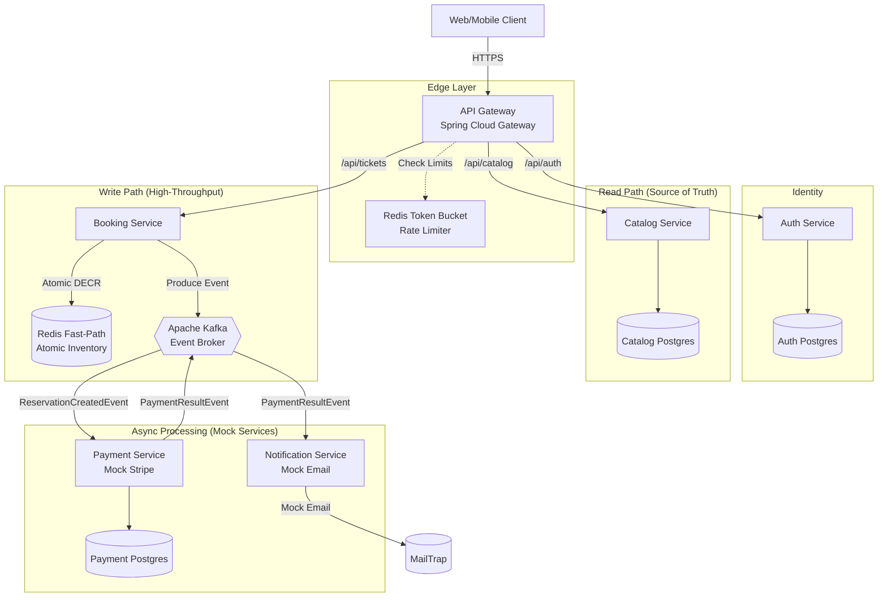

# 🎟️ TicketBlitz: High-Throughput Ticketing Architecture

TicketBlitz is an enterprise-grade, event-driven microservices platform designed to handle massive "thundering herd" traffic spikes during high-demand concert and sports ticket drops.

Unlike standard CRUD applications, TicketBlitz is engineered for **System Resilience** and **High Concurrency**, utilizing a Redis Fast-Path to protect the relational database from crashing under load, and Asymmetric Edge Security for zero-latency authentication.

## 📊 Current Implementation Status

| Service                     | Status   | Port | Description                                              |
| --------------------------- | -------- | ---- | -------------------------------------------------------- |
| ✅ **API Gateway**          | Complete | 8080 | Spring Cloud Gateway with rate limiting & JWT validation |
| ✅ **Auth Service**         | Complete | 8082 | JWT generation & user authentication                     |
| ✅ **Catalog Service**      | Complete | 8083 | Event catalog with PostgreSQL persistence                |
| ✅ **Booking Service**      | Complete | 8081 | High-throughput reservation engine with Redis & Kafka    |
| ✅ **Payment Service**      | Mock     | 8084 | Kafka-driven mock payment processing                     |
| ✅ **Notification Service** | Mock     | 8085 | Kafka-driven mock email notifications                    |

**Note:** Payment and Notification services are implemented as mocks suitable for a personal project demonstration.

## 🏗️ System Architecture



## 🧠 Core Engineering Decisions (The "Why")

**1. Stateless Edge Security (Asymmetric RSA-JWT)**

- **Problem:** Validating tokens at the microservice level creates a massive bottleneck if 10,000 users hit the system at once.
- **Solution:** The Auth Service signs JWTs using an RSA Private Key. The API Gateway holds the corresponding Public Key. The Gateway mathematically verifies the token signature at the edge in sub-milliseconds without ever making a network call to the Auth Service.

**2. The Redis Fast-Path (Atomic Token Bucket)**

- **Problem:** Traditional relational databases (PostgreSQL) lock rows during updates. If 5,000 users try to buy 100 tickets simultaneously, row-level locking will cause connection pool exhaustion and crash the database.
- **Solution:** The Booking Engine bypasses the database entirely. It executes an atomic DECR command against a Redis cache. This allows the system to definitively answer "Yes, you got the ticket" in memory, protecting the persistence layer.

**3. Event-Driven Eventual Consistency (Kafka)**

- **Problem:** Once a ticket is secured in Redis, we still need a permanent record in Postgres, but synchronous writes are too slow.
- **Solution:** The Booking Service acts as a Kafka Producer, dropping a ReservationCreatedEvent onto an asynchronous message broker. Downstream workers consume these messages at their own pace to update the slow-path database safely.

## 💻 Tech Stack

- **Language/Framework:** Java 21, Spring Boot 4.x (WebFlux & MVC)
- **API Gateway:** Spring Cloud Gateway
- **Security:** Spring Security, OAuth2 Resource Server, RS256 Cryptography
- **Messaging:** Apache Kafka (KRaft Mode)
- **Caching & Concurrency:** Redis (Lettuce Client)
- **Database:** PostgreSQL, Spring Data JPA, Hibernate
- **Containerization:** Docker & Docker Compose
- **Mock Services:** MailTrap (Email), Mock Stripe Provider (Payments)

## 🚀 Running the Project Locally

**Prerequisites:** Docker, Java 21, and Maven installed.

### 1. Generate RSA Key Pair (Required)

The Auth Service and API Gateway require RSA keys for JWT signing/validation:

```bash
# Generate private key in PKCS#8 format
openssl genrsa -out private_key.pem 2048
openssl pkcs8 -topk8 -inform PEM -outform PEM -in private_key.pem \
  -out private_key_pkcs8.pem -nocrypt

# Extract public key
openssl rsa -in private_key_pkcs8.pem -pubout -out public_key.pem

# Place keys in correct directories:
cp private_key_pkcs8.pem services/auth-service/src/main/resources/
cp public_key.pem api-gateway/src/main/resources/
```

### 2. Configure Environment

Create a `.env` file in the project root:

```bash
DB_PASSWORD=your_secure_password
MAILTRAP_USERNAME=your_mailtrap_username
MAILTRAP_PASSWORD=your_mailtrap_password
```

### 3. Start Infrastructure

Navigate to the `infrastructure/` directory and boot the Postgres, Redis, and Kafka cluster:

```bash
cd infrastructure
docker compose up -d
```

Verify containers are running:

```bash
docker ps
```

### 4. Start Microservices

Start services in this order using your IDE or Maven:

```bash
# Terminal 1: Auth Service
cd services/auth-service && mvn spring-boot:run

# Terminal 2: Catalog Service
cd services/catalog-service && mvn spring-boot:run

# Terminal 3: Booking Service
cd services/booking-service && mvn spring-boot:run

# Terminal 4: API Gateway
cd api-gateway && mvn spring-boot:run

# Terminal 5: Payment Service (Mock)
cd services/payment-service && mvn spring-boot:run

# Terminal 6: Notification Service (Mock)
cd services/notification-service && mvn spring-boot:run
```

### 5. Test the System

**1. Get Authentication Token:**

```bash
curl -X POST http://localhost:8080/api/auth/login \
  -H "Content-Type: application/json" \
  -d '{"username":"test@example.com","password":"password"}'
```

**2. View Event Catalog:**

```bash
curl http://localhost:8080/api/catalog/events
```

**3. Reserve Tickets (requires JWT token):**

```bash
curl -X POST http://localhost:8080/api/tickets/reserve \
  -H "Authorization: Bearer YOUR_JWT_TOKEN" \
  -H "Content-Type: application/json" \
  -d '{"eventId":1,"quantity":2}'
```

## 📁 Project Structure

```
ticketblitz/
├── api-gateway/                 # Spring Cloud Gateway (Port 8080)
├── services/
│   ├── auth-service/           # JWT Authentication (Port 8082)
│   ├── catalog-service/        # Event Catalog (Port 8083)
│   ├── booking-service/        # High-throughput reservations (Port 8081)
│   ├── payment-service/        # Mock payment processing (Port 8084)
│   └── notification-service/   # Mock email notifications
├── infrastructure/
│   └── docker-compose.yml      # PostgreSQL, Redis, Kafka
├── .env                        # Environment variables (create this)
└── README.md
```

## 🧪 Testing Status

**Current Coverage:** 0% (skeleton tests only)

- ✅ Context load tests for all services
- ❌ Unit tests for business logic
- ❌ Integration tests for Kafka flows
- ❌ E2E tests for booking workflow
- ❌ Load tests (k6/Gatling) for concurrent ticket drops

**Note:** As a personal project, comprehensive testing is planned for future development.

## 🔧 Development Notes

### Mock Services

- **Payment Service:** Uses MockStripeProvider for demonstration
- **Notification Service:** Sends emails via MailTrap SMTP
- Both services are Kafka-driven and don't expose REST APIs

### Key Files to Generate

- `private_key_pkcs8.pem` → `services/auth-service/src/main/resources/`
- `public_key.pem` → `api-gateway/src/main/resources/`

### Database Schema

- **events** (catalog-service): id, name, venue, eventDate, price
- **reservations** (booking-service): id, reservationId, eventId, userId, quantity, status
- **payment_records** (payment-service): id, reservationId, amount, status

## 🤝 Contributing

This is a personal project demonstrating advanced microservices patterns. The architecture showcases:

- **Asymmetric JWT Security** for edge validation
- **Redis Atomic Operations** for inventory management
- **Event-Driven Architecture** with Kafka
- **High Concurrency** with Java 21 virtual threads

For questions or contributions, feel free to open an issue or pull request.

---

This README demonstrates understanding of distributed systems challenges (concurrency, bottlenecks, database locking) and serves as a portfolio piece for advanced backend development skills.
